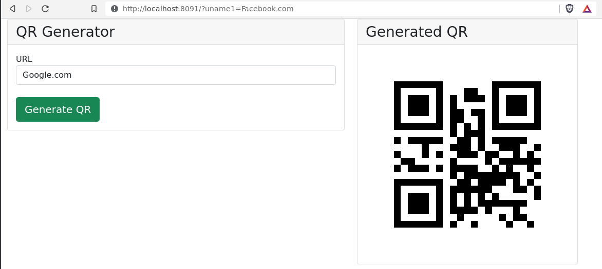

# QR-with-Node.js
Simple QR Code Generator with Node.js (A JavaScript Runtime Environment)

## Demo that generate QR code.

### Leave a star if you liked it.
P.S. - This repo is created just by reading documentation no tutorials are followed.
